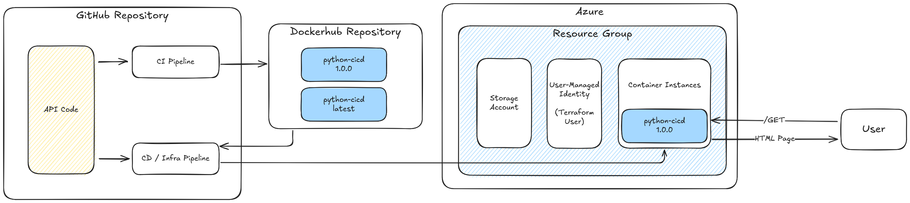

## Overview

In this project I created my first GitHub Actions pipelines to deploy a Python application. I created a simple API using FastAPI, setup Terraform scripts for an Azure Container Instances resource and implemented CI/CD pipelines to orchestrate the deployment of both. The result is an API that is automatically tested and deployed to Azure, where it is publically accessible.

In the CI/CD pipelines I use several tools to ensure code quality and security standards for both the Python and Terraform code. Examples of these tools are PyTest, MyPy, Bandit and Trivy.

The Python API uses FastAPI and is very simple, as the main focus of the repository is the deployment via GitHub Actions.

### Architecture

For more detailed info see [Infrastructure README](terraform/README.md).

I mainly use two GitHub Actions pipelines to deploy the API code to Azure. The first is the Continuous Integration pipeline. With regards to the Python code, it runs Unit tests, applies linting and format checking, and runs Static Application Security Tests (SAST) to scan for known vulnerabilities. The Terraform code is also checked for formating and validity. If all checks succeed, the "Scan and Push" stage is executed. This stage builds the Dockerimage for the Python Code, runs vulnerability checks via Trivy and uploads the built Docker image to Dockerhub.

The second pipeline is the Continuous Deployment or Infrastructure Creation pipeline. It plans and applies Terraform changes to build resources in the preconfigured Azure resource group. There is also a third, Infrastructure Destroy pipeline, however this is just used for debugging purposes.

The main focus is the deployment of a simple API into the cloud. Therefore I chose tools, which I was most familiar with and that get the job done:

- API: FastAPI was a natural choice since I worked with it in the past. In addition, its documentation and user base is really large, which helped me with research when I got stuck along the way. Another popular choice here would be Flask.
- Infrastructure As Code: Terraform is ubiquitous as a IaC tool. As industry standard, I chose to use it here. Alternatives would be OpenTofu or ARM Templates.
- Docker Image Security: I chose Trivy here, since it seems to be the most widely used application to scan Docker images for vulnerability. I also saw it in a couple of work projects and wanted to try it out.
- Azure Container Instances (ACI): As my deployment artefact is a Docker Image, I needed an Azure service to deploy it. ACI is the most lightweight solution for this in Azure. Alternatives would be Azure Kubernetes Service or Azure Virtual Machines.

## Prerequisites

I used the following Docker (Compose) versions to run this project:

- Docker version 28.1.0, build 4d8c241

## How to Run This Project

You need some external accounts (Dockerhub, Azure) and their secrets. In addition, I did not automate the whole Azure setup, meaning there is minimal setup work required in order to run the project. Please see the [Infrastructure README](./terraform/README.md) for detailed instructions.

1. Fork this repository
2. Run the GitHub Actions pipeline `Continuous Integration`
3. Run the GitHub Actions pipeline `Create Infrastructure Pipeline`
4. See the output of the `Terraform Apply` step `Create Infrastructure Pipelnie` for the IP of the deployed container
5. Type `http://CONTAINER_IP:8080/docs` (replace CONTAINER_IP by the IP address from step 4) in your browser to access the API docs
6. Run the GitHub Actions pipeline `Destroy Infrastructure Pipeline` to save costs and destroy all Terraform-created resources.

## Limitations

Due to time and scope there are a few limitations in this project, that would need to be addressed in a real-world use case.

**Missing environments**
Usually there would be separate deployment environments, at least Dev, Test and Prod. I'm aware of this but think it's out of scope for this repository. However, I added comments where this would change the existing pipeline code.

**No separation between Continuous Delivery and Infrastructure Pipeline**
In real-world use cases it's common to have both Continuous Delivery and Infrastructure Pipelines. The former pushes tested code into the environment where it is supposed to run, while the latter deploys the needed infrastructure, usually in the Cloud. Since my code runs as a Docker container in ACI, I realized that a separation between the two pipelines would be somewhat artificial here. This is why I chose to have only one CD / Infrastructure pipeline.

**Automatic version bumping of Python application**
The version of the Python code in Poetry (and therefore the Dockerhub images) is not automatically bumped, e.g. based on conventional commit messages. This can be achieved, for example, via Poetry plugins. This would save the need to manually bump the version number in the `pyproject.toml` file.

**Destruction pipeline is just for convenience**
A pipeline that destroys your whole environment would most likely not exist in a real-life use case. This one is just for convenience.

I'm sure there are more flaws in this project, some of which I'm aware and some most likely not. Since this is a learning project, I just wanted to point out the most obvious limitations.

## Lessons Learned

The main lesson I learned is how to write GitHub Actions pipelines, as I had no experience with them. In addition, I learned a lot about how to structure my pipelines and when to separate or combine stages or even whole pipelines.

On a technical level, I learned a lot about new tools for code and security checking, such as Trivy or Bandit. As these tools are often overlooked when implemeting the API itself, I found it exciting to think about handling them to deliver more secure software. Speaking of "secure", I learned a lot about handling authentication in modern systems using OIDC and short-lived credentials (see [Infrastructure README](./terraform/README.md)).

As for possible improvements, I would tackle the challenges described under "Limitations". Other relevant points for me personally would be to switch some components out, e.g. NodeJS instead of Python, AWS instead of Azure or using a private container registry (e.g. Harbor) instead of Dockerhub.